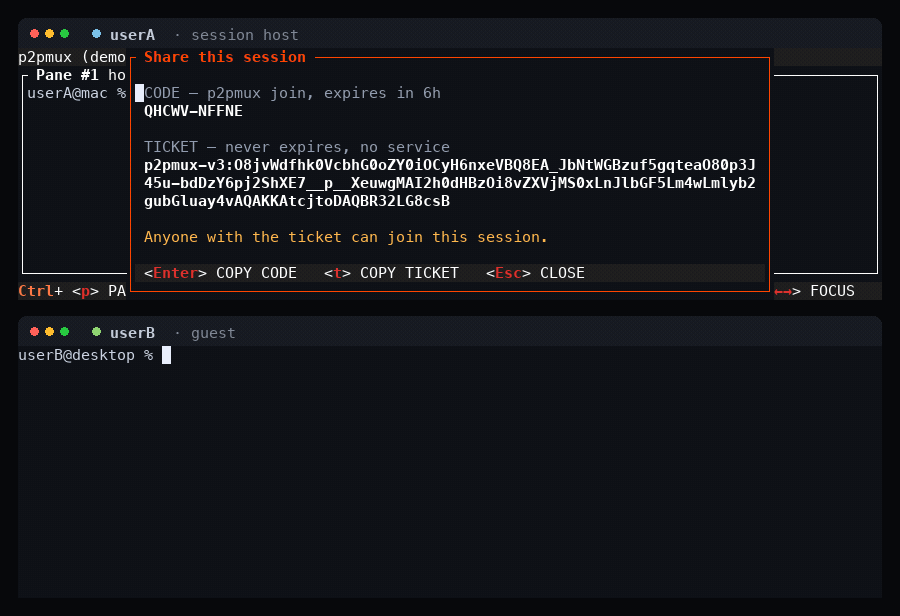

<div align="center">

<picture>
  <source media="(prefers-color-scheme: dark)" srcset="docs/assets/logo-wordmark-dark.svg">
  
</picture>

<p>
  <a href="https://github.com/pelazas/p2pmux/actions"></a>
  <a href="https://github.com/pelazas/p2pmux/releases"></a>
  <a href="https://crates.io/crates/p2pmux"></a>
  <a href="LICENSE"></a>
</p>

<p>
  <a href="https://p2pmux.com">Website</a> ·
  <a href="#install">Install</a> ·
  <a href="./docs/USAGE.md">Usage</a> ·
  <a href="#trust">Trust model</a> ·
  <a href="./CONTRIBUTING.md">Contributing</a>
</p>

</div>

**Everyone brings their own terminal.** Every pane runs on the machine of whoever opened it — their
toolchain, their libraries, their env, their AI subscription. Hop into a teammate's pane and you get
a real shell on *their* machine, running *their* setup, without ever holding their keys.

<p align="center">
  
</p>

<p align="center">
  <em>userB joins with the ten-character code, opens a pane of their own, then takes control of
  userA's pane and runs a command in it. Both windows are real clients; the pane titles say who
  hosts what.</em>
</p>

**A shared control surface, not a shared computer.** Your processes and credential files never
leave your machine. But whoever holds a pane has a real shell on the machine hosting it — both
halves are true at once, and [the trust model](#trust) says exactly what that means.

```sh
curl -fsSL https://p2pmux.com/install.sh | sh

p2pmux create                # you host; Ctrl+S shows the line to send
p2pmux join 4KP7Q-M2XRW      # them, on their own machine
```

`Ctrl+S` gives you that second line, ready to paste into a chat window. Your teammate runs it on
their own machine, on their own network, and lands in your grid. Ten characters, nothing else to
set up on either side. A Mac and a Linux box work the same session; nobody has to match anybody.

## Why it exists

Every other way to share a terminal collapses onto one box. SSH, tmux, tmate, screen sharing, cloud
dev environments — one machine runs everything, one person's toolchain is the only one in the room,
and one person's keys pay for it. Whoever joins arrives empty-handed.

p2pmux keeps the machines separate and joins the surface instead. You bring your laptop, your
dotfiles, your language versions and your Claude subscription. Your teammate brings theirs. Both
setups are live in the same grid at once, and either of you can reach into the other's.

Concretely: your teammate opens a pane on your machine and runs Claude Code on your subscription —
they drive it, you pay for it, they never see the key. The pane beside it is on their box, with
their Python env and their GPU, and you drive that one without installing a thing.

**That is all it does.** It is not a cloud VM, not a remote box everyone's processes run on, and
not an agent orchestration platform.

## What you get

- Every pane is a PTY on its owner's machine — shell, Docker, an agent — with that machine's PATH,
  env, and subscriptions. Host and guest are **per pane**, not per person.
- Take control of any free pane by typing into it, or hand yours over. Active typing is protected,
  so there is no forced takeover.
- Zellij-like tabs, panes, and nested splits, shared live: up to 8 members, 9 tabs, 8 panes a tab.
- Presence — a color per member, showing who is on which tab and watching which pane.
- The session outlives the machine that started it. If the coordinator's laptop closes, every pane
  on every other machine keeps running and keeps taking input; only structural edits pause, and
  after five minutes the earliest-joined survivor takes the role over.
- End-to-end encrypted peer-to-peer streaming, over an iroh relay when NAT requires it. The tab bar
  says which you got: `direct 55ms` or `relayed 120ms`.
- One ten-character join code, good for 6 hours, and nothing else to exchange — backed by a ticket
  that contacts no service at all, for when our rendezvous is down.
- An inbox — the screen bare `p2pmux` opens — listing every Claude Code, Codex, Cursor, Pi and
  OpenCode agent running on every machine in the session, sorted by which one is blocking you.
  Press Enter on a row and you are typing in that terminal; `Ctrl+O` brings you back. `needs you`
  comes only from the agent's own hooks, never from guessing at output timing: run
  `p2pmux setup claude` once, and `p2pmux doctor` to check. An agent with no hooks says
  *state unknown — no hooks* on its own row rather than being guessed about.
- `p2pmux pair` associates two machines you own, once and permanently. After that, bare `p2pmux`
  rejoins on either with no code typed, and `p2pmux machines` says which of them are awake.

## Status

**Early, but real.** v0.1.4 runs sessions between machines on different networks and different
continents. macOS and Linux, both architectures. A coordinator that dies no longer ends the
session — a survivor takes the role over, with a new join code — but a pane whose host is gone
stays in the layout as a placeholder rather than being reaped on a timer.

## Install

```sh
curl -fsSL https://p2pmux.com/install.sh | sh
```

macOS and Linux, Apple Silicon, Intel and arm64. The script fetches a binary and its SHA256 from
GitHub Releases and checks the hash before installing. It is served as plain text so you can read
it first.

If you would rather not run an installer at all, it is [on crates.io](https://crates.io/crates/p2pmux):

```sh
cargo install p2pmux --locked
```

Linux builds link glibc 2.35 or newer — Ubuntu 22.04, Debian 12, Fedora 36 and up. A musl system
has to build from source.

Updating is however you installed:

```sh
brew update && brew upgrade p2pmux                                   # Homebrew tap
curl -fsSL https://p2pmux.com/install.sh | sh                        # the install script, again
cargo install p2pmux --locked --force                                # from source
```

`p2pmux --version` says what you are running. Sessions already running keep the binary they
started with — the node is a long-lived process — so `p2pmux kill <name>` and start again to pick
a new version up.

## Trust

A p2pmux session is a **fully trusted shared shell**. Anyone with the join code or ticket can see
every pane and can obtain interactive control of the terminals in it — run commands, read output,
touch any file that user account can touch.

Processes and credential *files* stay on the pane host's machine and are never uploaded to peers.
That is a real boundary, and it is the point of the design. It is **not** a sandbox: a controller
can still use your credentials, or print one to the screen, through the shell you handed them.

So: treat the code like a password, and share it only with people you would hand an unlocked
laptop to. For anyone else, use a separate low-privilege account and keep production credentials
out of shared panes.

## Using it

Run `p2pmux` with no arguments and you land on the inbox. `Ctrl+O` returns to it from anywhere,
including from inside a live terminal; `Ctrl+A` does the same, for the muscle memory the old
agents overlay built. `Ctrl+S` shares, `Ctrl+P` is pane mode, `Ctrl+T` is tab mode, and `Ctrl+Q`
detaches your view while the session keeps running. `p2pmux --resume` brings back a specific
session by name.

Full walkthrough — keys, control leases, presence, mouse, scrollback, agent hooks and every config
key — is in [docs/USAGE.md](./docs/USAGE.md).

## Docs

| Doc | Description |
|-----|-------------|
| [docs/USAGE.md](./docs/USAGE.md) | Everything you can do once it is running |
| [docs/PRODUCT.md](./docs/PRODUCT.md) | Vision, is/isn't, why it matters |
| [docs/MVP_DESIGN.md](./docs/MVP_DESIGN.md) | **Locked** MVP design (source of truth) |
| [docs/SPIKE_PLAN.md](./docs/SPIKE_PLAN.md) | Build order / spikes |

Built in Rust with ratatui, portable-pty, vt100, and iroh. macOS and Linux.

Found a rough edge? Please open an issue — a specific report of what broke is the most useful
thing anyone can send right now.

## License

[MIT](LICENSE).
