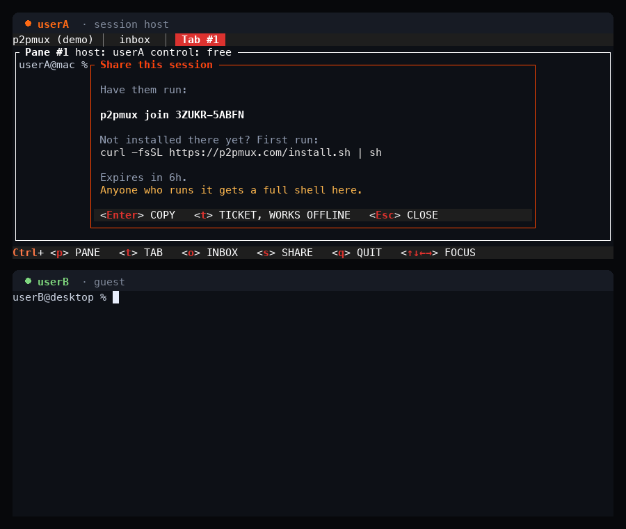

<div align="center">

<picture>
  <source media="(prefers-color-scheme: dark)" srcset="assets/logo-wordmark-dark.svg">
  
</picture>

<p>
  <a href="https://github.com/pelazas/p2pmux/actions"></a>
  <a href="https://github.com/pelazas/p2pmux/releases"></a>
  <a href="https://crates.io/crates/p2pmux"></a>
  <a href="LICENSE"></a>
</p>

<p>
  <a href="https://p2pmux.com">Website</a> ·
  <a href="#install">Install</a> ·
  <a href="./USAGE.md">Usage</a> ·
  <a href="#trust">Trust</a> ·
  <a href="./CONTRIBUTING.md">Contributing</a>
</p>

</div>

Peer-to-peer terminal multiplexer for macOS and Linux. Every pane is a real shell on the machine of whoever opened it: their toolchain, their env, their AI subscription. Hop into a teammate's pane and you get a shell on their machine without holding their keys.

<p align="center">
  
</p>

<p align="center">
  <em>userB joins with the ten-character code, opens a pane of their own, then takes
  control of userA's pane and runs a command in it. Both windows are real clients;
  the pane titles say who hosts what.</em>
</p>

```sh
curl -fsSL https://p2pmux.com/install.sh | sh

p2pmux                       # you host; Ctrl+S shows the line to send
p2pmux join 4KP7Q-M2XRW      # them, on their own machine
```

`Ctrl+S` copies that second line so you can paste it into a chat. A Mac and a Linux box work in the same session.

The join code is a password. Anyone who has it can take a real shell on every pane they control. Read [the trust model](#trust) before you send it.

## Install

```sh
curl -fsSL https://p2pmux.com/install.sh | sh
```

macOS and Linux, x86_64 and arm64. The script fetches a binary and its SHA256 from GitHub Releases and checks the hash before installing. You can [read the script](https://p2pmux.com/install.sh) first. Binaries come from GitHub, not from p2pmux.com.

Homebrew:

```sh
brew tap pelazas/tap
brew trust pelazas/tap
brew install p2pmux
```

Homebrew 6 will not load a formula from a third-party tap until you trust it. On Homebrew 5, skip `brew trust`.

From source (Rust 1.91 or newer):

```sh
cargo install p2pmux --locked
```

Linux builds need glibc 2.35 or newer (Ubuntu 22.04, Debian 12, Fedora 36 and up). A musl system has to build from source. Windows is not supported.

Update the same way you installed. `p2pmux --version` prints what you are running. A session already running keeps the binary it started with, so `p2pmux kill <name>` and start again to pick up a new version.

## Quick start

Two terminals on this machine:

```sh
p2pmux create                # terminal 1; Ctrl+S copies the join line
p2pmux join 4KP7Q-M2XRW      # terminal 2
```

Two machines you own: `p2pmux pair` on the new one, then `p2pmux pair <code>` on this one. After that, `p2pmux` rejoins on either without a code.

| Command | What it does |
| --- | --- |
| `p2pmux` | Start or rejoin a session |
| `p2pmux join <code>` | Join someone else's session |
| `p2pmux attach [name]` | Attach to a session already running here |
| `p2pmux pair` | Pair a machine you own |
| `p2pmux list` | List live sessions on this machine |
| `p2pmux kill <name>` | Stop a session |
| `p2pmux setup` | Install agent hooks |
| `p2pmux doctor` | Check the install |

The join code lasts six hours. If rendezvous is down, `Ctrl+S` offers a ticket that contacts no service at all.

## What you get

- Every pane is a PTY on its owner's machine. Host and guest are per pane, not per person.
- Type into a free pane to take control. Active typing is protected. Nobody can take the keyboard while you are typing.
- Shared tabs, panes, and nested splits. Up to 8 members, 9 tabs, 8 panes per tab.
- End-to-end encrypted peer-to-peer streaming, over an iroh relay when NAT requires it. The tab bar shows `direct 55ms` or `relayed 120ms`.
- If the coordinator's laptop closes, panes on every other machine keep running. Layout changes and new joins pause. After five minutes the earliest-joined survivor takes over.
- `Ctrl+O` lists every detected coding agent on every machine in the session, sorted by which one is blocking you. Press Enter to type in that terminal.

## Keys

| Key | Action |
| --- | --- |
| `Ctrl+` arrows | Focus a neighboring pane |
| `Ctrl+P` | Pane mode (split, close, lock, zoom) |
| `Ctrl+T` | Tab mode |
| `Ctrl+S` | Copy the join line |
| `Ctrl+O` | Inbox |
| `Ctrl+Q` | `d` detaches; closing the window ends the session |

Keys, mouse, scrollback, pairing, agent hooks, and config: [USAGE.md](./USAGE.md).

## Trust

A p2pmux session is a fully trusted shared shell. Anyone with the join code or ticket can see every pane and can obtain interactive control of the terminals in it: run commands, read output, touch any file that user account can touch.

Processes and credential files stay on the pane host's machine and are never uploaded to peers. That is a real boundary. It is not a sandbox: a controller can still use your credentials, or print one to the screen, through the shell you handed them.

Treat the code like a password. Share it only with people you would hand an unlocked laptop to. For anyone else, use a separate low-privilege account and keep production credentials out of shared panes.

The longer version is at [p2pmux.com/trust](https://p2pmux.com/trust).

## Telemetry

On first run, p2pmux asks whether it may send one anonymous line a day. Enter means yes. Nothing is sent before you answer, and nothing is sent if you say no. `p2pmux telemetry off` stops it. `DO_NOT_TRACK=1` and `CI` skip the prompt and send nothing. A machine with no terminal to ask in, such as a droplet running `p2pmux daemon`, is never asked and never sends.

## Status

Early, but real. Sessions run between machines on different networks, on macOS and Linux. Peers must share a protocol pin; [CHANGELOG.md](./CHANGELOG.md#compatibility) lists which releases can join each other.

Found a rough edge? Open an issue with `p2pmux --version` on both machines and whether the tab bar said `direct` or `relayed`.

## License

[MIT](LICENSE).
