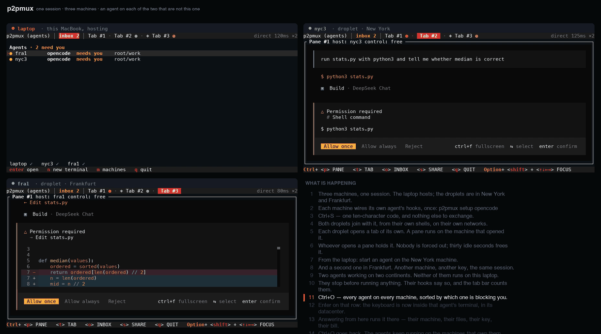

<div align="center">

<picture>
  <source media="(prefers-color-scheme: dark)" srcset="docs/assets/logo-wordmark-dark.svg">
  
</picture>

<p>
  <a href="https://github.com/pelazas/p2pmux/actions"></a>
  <a href="https://github.com/pelazas/p2pmux/releases"></a>
  <a href="https://crates.io/crates/p2pmux"></a>
  <a href="LICENSE"></a>
</p>

<p>
  <a href="https://p2pmux.com">Website</a> ·
  <a href="#install">Install</a> ·
  <a href="./docs/USAGE.md">Usage</a> ·
  <a href="#trust">Trust model</a> ·
  <a href="#faq">FAQ</a> ·
  <a href="./CONTRIBUTING.md">Contributing</a>
</p>

</div>

Peer-to-peer terminal multiplexer for macOS and Linux. **Everyone brings their own
terminal.** Every pane runs on the machine of whoever opened it — their toolchain,
their libraries, their env, their AI subscription. Hop into a teammate's pane and you
get a real shell on *their* machine, running *their* setup, without ever holding their
keys.

**A shared control surface, not a shared computer.** Your processes and credential
files never leave your machine. But whoever holds a pane has a real shell on the
machine hosting it — both halves are true at once, and [the trust model](#trust) says
exactly what that means.

<p align="center">
  
</p>

<p align="center">
  <em>userB joins with the ten-character code, opens a pane of their own, then takes
  control of userA's pane and runs a command in it. Both windows are real clients;
  the pane titles say who hosts what.</em>
</p>

```sh
curl -fsSL https://p2pmux.com/install.sh | sh

p2pmux                       # you host; Ctrl+S shows the line to send
p2pmux join 4KP7Q-M2XRW      # them, on their own machine
```

`Ctrl+S` gives you that second line, ready to paste into a chat window. Your teammate
runs it on their own machine, on their own network, and lands in your grid. A Mac and
a Linux box work the same session; nobody has to match anybody.

No second person yet? Two terminals on this machine is enough to see the grid:

```sh
p2pmux create                # terminal 1; Ctrl+S copies the join line
p2pmux join 4KP7Q-M2XRW      # terminal 2
```

Two machines you already own: `p2pmux pair` on the new one, then `p2pmux pair <code>`
on this one. After that, bare `p2pmux` rejoins on either with no code typed.
[Your machines](#your-machines).

The join code is a password. Anyone who has it can take a real shell on every pane
they control. It is not a sandbox. [Read the trust model](#trust) before you send it.

## Why it exists

Every other way to share a terminal collapses onto one box. SSH, tmux, tmate, screen
sharing, cloud workspaces — one machine runs the processes, one account's toolchain
is the only one in the room, and one person's keys pay for it. Whoever joins arrives
empty-handed.

p2pmux keeps the machines separate and joins the surface instead. You bring your
laptop, your dotfiles, your language versions and your Claude subscription. Your
teammate brings theirs. Both setups are live in the same grid at once, and either of
you can reach into the other's.

| | Where the process runs | Credentials used there | How people join |
|---|---|---|---|
| SSH + tmux | One tmux host | An account on that host | SSH |
| tmate | One shared-session host | That host's account | tmate link |
| Screen share / cloud workspace | Shared machine or workspace | Varies by product | Share or invite |
| **p2pmux** | Each pane owner's machine | That pane owner's account | 10-character code |

Concretely: your teammate opens a pane on your machine and runs Claude Code on your
subscription — they drive it, you pay for it, they never see the key. The pane beside
it is on their box, with their Python env and their GPU, and you drive that one
without installing a thing.

**That is all it does.** It is not a cloud VM, not a remote box everyone's processes
run on, and not an agent orchestration platform.

## What you get

- Every pane is a PTY on its owner's machine — shell, Docker, an agent — with that
  machine's PATH, env, and subscriptions. Host and guest are **per pane**, not per
  person.
- Take control of any free pane by typing into it, or hand yours over. Active typing
  is protected, so there is no forced takeover.
- Zellij-like tabs, panes, and nested splits, shared live, with presence: up to 8
  members, 9 tabs, 8 panes a tab.
- End-to-end encrypted peer-to-peer streaming, over an iroh relay when NAT requires
  it. The tab bar says which you got: `direct 55ms` or `relayed 120ms`.
- If the coordinator's laptop closes, panes on every *other* machine keep running and
  keep taking input. Layout changes and new joins pause; after five minutes the
  earliest-joined survivor takes the role over. Panes on the machine that left stay
  as unavailable placeholders until it comes back.
- One ten-character join code, refreshed while the session is live and gone within
  six hours of the last refresh — backed by a ticket that contacts no service at all,
  for when our rendezvous is down.

### Inbox

Bare `p2pmux` opens the inbox when it rejoins a session you already have — and
`Ctrl+O` opens it from anywhere. It lists every Claude Code, Codex, Cursor, Pi,
OpenCode, Hermes and OpenClaw agent running on every machine in the session, sorted
by which one is blocking you. Press Enter on a row and you are typing in that
terminal; `Ctrl+O` brings you back.

`needs you` comes only from the agent's own hooks, never from guessing at output
timing. Run `p2pmux setup` once, and `p2pmux doctor` to check. An agent with no hooks
says *state unknown — no hooks* on its own row rather than being guessed about.

<p align="center">
  <a href="docs/assets/workflow.mp4">
    
  </a>
</p>

<p align="center">
  <em><a href="docs/assets/workflow.mp4">Ninety seconds, three machines</a>: a
  MacBook and two DigitalOcean droplets share one session, an
  <code>opencode</code> agent is started from the laptop on each droplet, and the
  inbox says which of them is blocking a human.</em>
</p>

### Your machines

`p2pmux pair` on the new machine prints a code; `p2pmux pair <code>` on one you
already own consumes it. The code lasts ten minutes and admits one machine.
`p2pmux machines` then says which of them are awake.

A machine with nobody sitting at it is a second step. Pair two machines by hand
first — `p2pmux enroll` cannot start a fleet on its own — then `p2pmux enroll`
prints a revocable token to paste into a provisioning script. On that box,
`p2pmux daemon install` is what brings it back after a reboot.

What your machines may start on one of them is written on that machine:
`p2pmux work allow <command>` matches the full command; bare `p2pmux work allow`
permits a login shell. Default closed. Being in your fleet grants nothing on its
own.

## Trust

A p2pmux session is a **fully trusted shared shell**. Anyone with the join code or
ticket can see every pane and can obtain interactive control of the terminals in it
— run commands, read output, touch any file that user account can touch.

Processes and credential *files* stay on the pane host's machine and are never
uploaded to peers. That is a real boundary, and it is the point of the design. It is
**not** a sandbox: a controller can still use your credentials, or print one to the
screen, through the shell you handed them.

So: treat the code like a password, and share it only with people you would hand an
unlocked laptop to. For anyone else, use a separate low-privilege account and keep
production credentials out of shared panes.

The longer version is at [p2pmux.com/trust](https://p2pmux.com/trust).

## Telemetry

p2pmux asks, once, on first run, whether it may send **one anonymous line a day**. Enter
means yes. Nothing is sent before you answer, and nothing is sent if you say no.

The line is, in full:

```json
{
  "id": "a random id, generated on your machine when you say yes",
  "version": "0.1.13",
  "os": "macos-aarch64",
  "sessions": 3,
  "peers": 1,
  "agents": 12,
  "activated": true
}
```

There is no field for a hostname, a directory, a session name, a command, or anything
you typed, and no setting that adds one — the whole schema is
[eight columns](services/metrics/schema.sql) in a file you can read. Terminal traffic
never goes near it; that stays peer to peer. The id is **not** derived from your machine
key, which is announced to peers — a number tied to that would be a number tied to an
identity other people have seen.

```sh
p2pmux telemetry          # is anything being sent, and where the answer is stored
p2pmux telemetry show     # print the exact line this machine would send
p2pmux telemetry off      # stop
```

`DO_NOT_TRACK=1` and `CI` are honoured without being asked. A machine with no terminal to
ask in — a droplet running `p2pmux daemon` — is never asked and never sends. The state
lives in `~/.config/p2pmux/telemetry.json`; delete it and this machine is a new install.

Most developer tools collect this quietly and let you opt out in a settings file. That
gets better numbers, and it is the wrong trade for a tool whose whole claim is that your
keys stay on your disk. The cost is real: these numbers undercount actual use by an
unknown amount, permanently. Details in [`services/metrics/`](services/metrics/).

Separately, and once in the life of a machine: after a session that had a second person in
it, p2pmux prints one line asking what you were doing, with a link. Numbers say whether
anybody came back; they cannot say what for. It is printed as the session closes, it takes
no answer, and it never appears again.

## Install

### Install script

```sh
curl -fsSL https://p2pmux.com/install.sh | sh
```

macOS and Linux, x86_64 and arm64 (Intel and Apple Silicon). The script fetches a
binary and its SHA256 from GitHub Releases and checks the hash before installing.
It is served as plain text, so you can [read it in a browser](https://p2pmux.com/install.sh)
first — the binaries never come from this domain, only from GitHub.

### Homebrew

```sh
brew tap pelazas/tap
brew trust pelazas/tap
brew install p2pmux
```

Homebrew 6 will not load a formula from a third-party tap until you trust it, so the
middle line is not optional there. On Homebrew 5 that command does not exist — skip
it.

### From source

```sh
cargo install p2pmux --locked
```

That path builds from source and needs **Rust 1.91 or newer** — iroh 1.0 sets the
floor, and an older toolchain refuses the lockfile rather than building something
subtly different.

### Platforms

- macOS and Linux; Windows is not supported.
- Linux builds link glibc 2.35 or newer — Ubuntu 22.04, Debian 12, Fedora 36 and up.
- A musl system has to build from source.

Updating is however you installed:

```sh
brew update && brew upgrade p2pmux                                   # Homebrew tap
curl -fsSL https://p2pmux.com/install.sh | sh                        # the install script, again
cargo install p2pmux --locked --force                                # from source
```

`p2pmux --version` says what you are running. Sessions already running keep the
binary they started with — the node is a long-lived process — so `p2pmux kill <name>`
and start again to pick a new version up.

## Status

**Early, but real.** Sessions run between machines on different networks and
different continents, on macOS and Linux, both architectures. Claude Code and
OpenCode report their own state through hooks; Codex, Cursor, Pi, Hermes and
OpenClaw are detected but have no hooks yet, so their rows say so rather than
guessing. A coordinator that dies no longer ends the session.

Version history and upgrade notes are in [CHANGELOG.md](./CHANGELOG.md). Peers must
share a protocol pin — the changelog says [which releases can join each
other](./CHANGELOG.md#compatibility).

## FAQ

**Is this a sandbox?**
No. A p2pmux session is a fully trusted shared shell. Treat the join code like a
password. [Trust model](#trust).

**Do I need a second person?**
No. `p2pmux create` in one terminal and `p2pmux join <code>` in another is enough to
see the grid. Two machines you own: `p2pmux pair`.

**Can p2pmux.com see my terminal?**
Not the contents. The rendezvous service stores an opaque handle and a sealed blob.
Pane streams travel peer-to-peer, or through an iroh relay when NAT requires it;
the tab bar says which. We do not run that relay.

**Does it work on Windows?**
Not yet. macOS and Linux only.

**They cannot join / versions disagree?**
Everyone in a session has to share a protocol pin. Run `p2pmux --version` on both
machines and check [CHANGELOG.md](./CHANGELOG.md#compatibility).

Keys, control leases, presence, mouse, scrollback, agent hooks and every config key
are in [docs/USAGE.md](./docs/USAGE.md).

## Docs

| Doc | Description |
|-----|-------------|
| [docs/USAGE.md](./docs/USAGE.md) | Everything you can do once it is running |
| [CHANGELOG.md](./CHANGELOG.md) | What changed in each release, and which versions interoperate |
| [CONTRIBUTING.md](./CONTRIBUTING.md) | Bug reports, build, and what gets merged |
| [p2pmux.com/trust](https://p2pmux.com/trust) | What a join code grants, and what rendezvous can see |

Built in Rust with ratatui, portable-pty, vt100, and iroh. macOS and Linux.

Found a rough edge? Please open an issue — a specific report of what broke is the
most useful thing anyone can send right now.

## License

[MIT](LICENSE).
